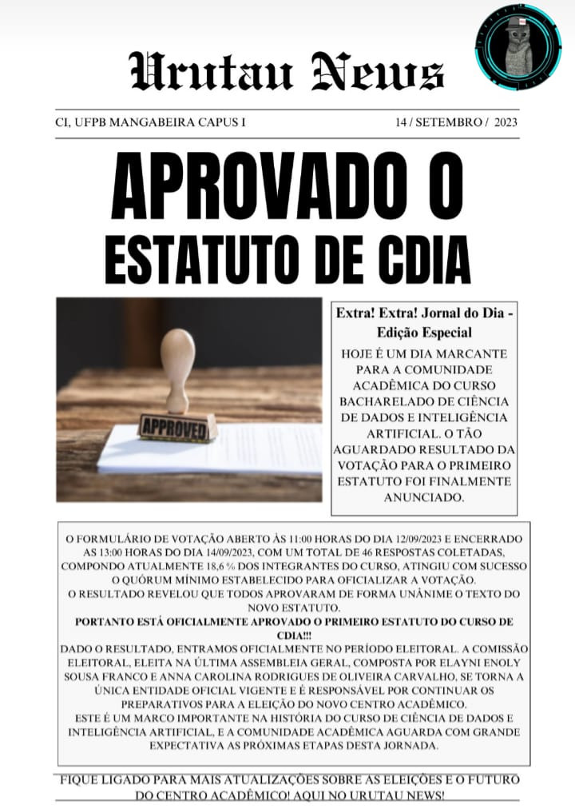

# Portal de Transparência do Centro Acadêmico de Ciência de Dados e Inteligência Artificial

Este repositório corresponde ao portal de transparência do Centro Acadêmico do Curso de Bacharelado em Ciência de Dados e Inteligência Artificial da Universidade Federal da Paraíba (UFPB).

## Notícias Importantes

- **Urutau News 001 (JPEG)**
  - Primeira edição do jornal digital e físico Urutau News, mídia independente do Centro de Informática da UFPB, gerida pelo Centro Acadêmico de Ciência de Dados e Inteligência Artificial. Destaque para a notícia da aprovação do estatuto.

**Nota:** Os links abaixo direcionam para os arquivos presentes neste repositório. Para mais informações, entre em contato com o Centro Acadêmico de Ciência de Dados e Inteligência Artificial da UFPB.

## Documentos Importantes

- [Estatuto do Centro Acadêmico de Ciência de Dados e Inteligência Artificial (PDF)](./ESTATUTO%20CENTRO%20ACAD%C3%8AMICO%20DE%20CI%C3%8ANCIA%20DE%20DADOS.pdf)
  - Estatuto discutido na assembleia geral do dia 31/08/2023 e aprovado via votação no dia 14/09/2023.

- [Assinaturas e Votos - Estatuto CACDIA (PDF)](./Assinaturas_Votos%20Estatuto%20CACDIA%20-%20Respostas%20ao%20formul%C3%A1rio%201.pdf)
  - Resultados da votação do novo estatuto, com 100% de aprovação por unanimidade.

